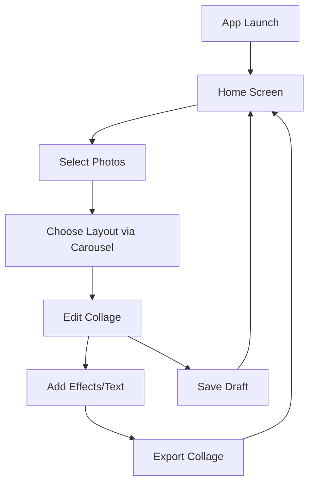
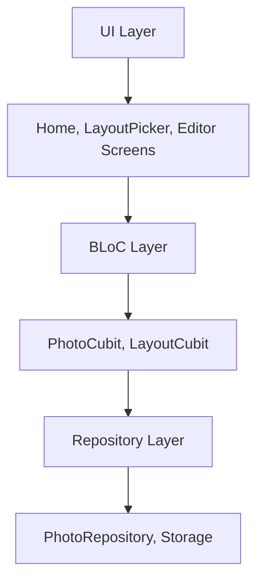

# Photo Collage Maker App Plan

## App Overview
"CollageCraft" is a Flutter app for creating photo collages, including panorama collages. Users select photos via a carousel, choose layouts, edit collages, and export them.

## Requirements and Features
- **Photo Selection**: Gallery access with carousel/grid view for picking multiple photos.
- **Layout Selection**: Carousel of templates (e.g., 2x2 grid, freeform, panorama stitch).
- **Collage Editor**:
  - Drag/drop photos onto canvas.
  - Resize, rotate, crop photos.
  - Add text, stickers, filters.
  - Panorama mode: Horizontal stitching for wide collages.
- **Export**: Save as PNG/JPG, share via social media.
- **UI**: Intuitive, with bottom navigation, toolbars.

## Research Insights
Collage apps (e.g., PicsArt Collage) use:
- Carousel for template selection (PageView/CarouselSlider).
- Drag-and-drop with Positioned widgets.
- Image processing with packages like image_editor or extended_image.

Panorama: Blend edges for seamless stitching.

## System Architecture
- **Layers**:
  - Presentation: Screens (Home, LayoutPicker, Editor), Widgets (PhotoGrid, CarouselSlider).
  - Business Logic: BLoC/Cubit for managing selected photos, current layout, collage state.
  - Data: Repositories for photo access, local storage for drafts.
- **State Management**: BLoC for reactive updates (e.g., photo selection, layout changes).
- **Navigation**: Bottom navigation bar or stack for editor flow.
- **Performance**: Use image caching, limit canvas size for smooth editing.

## Technology Stack
- **Core**: Flutter 3.0+, Dart.
- **State Management**: flutter_bloc for BLoC/Cubit.
- **Image Handling**: image_picker for selection, extended_image for editing (crop, rotate), photo_manager for gallery access.
- **Carousel**: carousel_slider for layout/template selection.
- **Panorama/Export**: image package for stitching and saving collages.
- **Permissions**: permission_handler for gallery access.
- **Storage**: path_provider for saving exports.

## UI/UX Wireframes
- **Home Screen**: Grid of recent photos, "New Collage" button, bottom nav (Home, Templates, Editor).
- **Photo Selection**: Carousel slider for gallery photos, select multiple, "Next" to layouts.
- **Layout Picker**: Carousel of templates (e.g., grid icons), tap to select.
- **Editor Screen**: Canvas with positioned photos, bottom toolbar (resize, rotate, add text), floating export button.
- **Panorama Mode**: Wide canvas for side-by-side photos, stitching preview.

## Data Models and Storage
- **Models**:
  - Photo: { path: String, width: int, height: int }
  - Layout: { type: String (grid/panorama), positions: List<Offset> (for photo placements) }
  - Collage: { photos: List<Photo>, layout: Layout, edits: Map (for transformations) }
- **Storage**: In-memory for session, SQLite (sqflite) for saving drafts, path_provider for exports.

## Mermaid Diagrams

### App Flow Diagram

### Architecture Diagram
