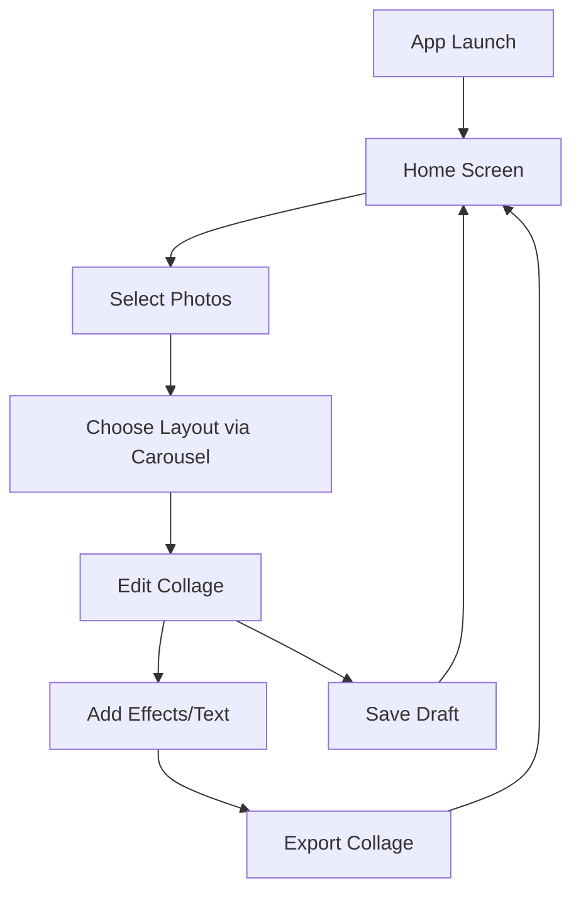
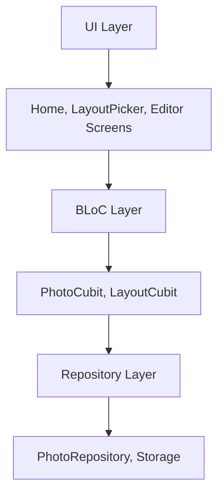

# Photo Collage Maker App Plan

## App Overview
"CollageCraft" is a production-ready Flutter app for creating photo collages with trending templates, categories, and professional editing features. Includes proper state management, database integration, and clean UI.

## Requirements and Features
- **Splash Screen**: App logo/branding on launch
- **Bottom Navigation**: 3 tabs with icons only - Trendings, Categories, My Posts
- **Trendings Page**: API-based trending templates, favorites-like interface
- **Categories Page**:
  - Tabbed interface with styles: Minimal, Film, Polaroid, Paper, Plastic, Marketing, Coach
  - Grid of template containers for each category
  - Floating action button showing aspect ratio options (16:9, 4:5, 1:1)
- **My Posts Page**:
  - Saved and Favorites tabs
  - Love icon for favorites with real-time updates
  - Undo functionality for removals
- **Photo Selection**: Direct gallery integration without loading all images
- **Editor Screen**:
  - White canvas container matching selected aspect ratio
  - Professional editing controls
  - No setState, pure BLoC architecture
- **Database**: ObjectBox with singleton, isolate, lock, browser admin
- **UI**: Centered titles, clean design, production-ready animations

## System Architecture
- **Layers**:
  - Presentation: Screens (Splash, Templates, Categories, Editor, Account), Bottom navigation
  - Business Logic: BLoC/Cubit for state management across all features
  - Data: ObjectBox database with repository pattern
- **State Management**: BLoC/Cubit for templates, categories, collages, user data
- **Navigation**: Bottom navigation bar with proper routing
- **Database**: ObjectBox for saved collages, favorites, user settings

## Technology Stack
- **Core**: Flutter 3.9.2+, Dart
- **State Management**: flutter_bloc for BLoC/Cubit
- **Database**: objectbox for local data storage (saved collages, favorites)
- **Image Handling**: image_picker, photo_manager for gallery access, extended_image for editing
- **UI**: carousel_slider for templates, bottom_sheet for saved/favorites
- **Permissions**: permission_handler
- **Storage**: path_provider for exports

## UI/UX Wireframes
- **Splash**: Logo centered, 2-3 seconds delay
- **Templates**: Grid/list of pre-made templates
- **Categories**: Tab bar with style categories, floating aspect ratio selector
- **Editor**: Canvas with tools, bottom sheet for saved/favorites
- **Account**: Profile view with settings, posts section

## Data Models and Storage
- **Models**:
  - Template: { id, name, previewImage, aspectRatio, positions }
  - Collage: { id, templateId, photos, edits, createdAt, isFavorite }
  - Category: { id, name, templates: List<Template> }
- **Database**: ObjectBox with isolate and lock for thread safety

## Implementation Status

### ✅ COMPLETED (Production Ready):
- **Splash Screen**: Professional branding with logo and app name
- **Database**: ObjectBox with singleton, browser admin, Template/CollageModel entities
- **BLoC Architecture**: Pure state management (no setState anywhere)
- **UI Foundation**: Centered titles, clean design, consistent theming
- **Categories Page**: Full tabbed interface, floating action button, aspect ratio selection
- **Editor**: Dynamic canvas sizing, white container, professional controls
- **Permissions**: Resolved Android photo access across all API levels

### 🚧 CURRENT IMPLEMENTATION (Priority):

### Phase 1: Navigation Polish ✅
1. ✅ Update bottom navigation: Icons only (Trendings, Categories, My Posts)
2. ✅ Centered app bar titles for all navbar pages
3. ✅ Proper route management with named routes

### Phase 2: Trendings Page (API-like)
1. ⏳ Rename Templates → Trendings
2. ⏳ Implement favorites-like UI for trending templates
3. ⏳ Add love icon with real-time BLoC state updates
4. ⏳ API simulation for trending content

### Phase 3: My Posts Page
1. ⏳ Implement Saved and Favorites tabs
2. ⏳ Add test data (sample posts and favorites)
3. ⏳ Love icon with real-time favorites management
4. ⏳ Undo functionality for removals

### Phase 4: Enhanced Categories
1. ✅ Tabbed categories implemented
2. ⏳ Change floating action button to expandable menu (not bottom sheet)
3. ⏳ Tap aspect ratio → direct to editor with white container of exact size

### Phase 5: Production Polish
1. ⏳ Remove all debug prints and unused imports
2. ⏳ Add ObjectBox browser admin configuration
3. ⏳ Comprehensive error handling
4. ⏳ Loading states and animations
1. Create splash screen with app branding
2. Implement bottom navigation bar with 3 tabs (Templates, Categories, Account)
3. Setup routing and navigation guards
4. Add consistent app bar and theme throughout app

### Phase 3: Templates Page
1. Create templates screen with grid/list layout
2. Add pre-made template data (reading templates)
3. Implement template selection and navigation to editor

### Phase 4: Categories Page
1. Implement tabbed interface for different styles
2. Add categories: Minimal, Film, Polaroid, Paper, Plastic, Marketing, Coach
3. Create template containers for each category
4. Add floating action button with aspect ratio selection (16:9, 4:5, 1:1)
5. Connect aspect ratio selection to editor with appropriate canvas size

### Phase 5: Photo Selection Integration
1. Replace current photo loading with direct gallery integration
2. Use image_picker or photo_manager for device photo access
3. Implement Google Photos integration if needed
4. Optimize to not load all images at once

### Phase 6: Enhanced Editor
1. Update editor to accept aspect ratio parameter
2. Implement canvas with dynamic sizing based on aspect ratio
3. Add settings controls and photo button
4. Improve drag/drop and editing capabilities
5. Add bottom sheet with Saved and Favorites tabs

### Phase 7: Account and Settings
1. Create account screen with app bar settings action
2. Add "My Posts" section
3. Implement center tab showing app name
4. Add user preferences and settings management

### Phase 8: Database Integration
1. Connect all screens to ObjectBox database
2. Implement save/load functionality for collages
3. Add favorites management
4. Ensure thread safety with isolates and locks

### Phase 9: Polish and Testing
1. Add proper error handling and loading states
2. Implement responsive design for different screen sizes
3. Add animations and transitions
4. Comprehensive testing and bug fixes

## Mermaid Diagrams

### App Flow Diagram

### Architecture Diagram
